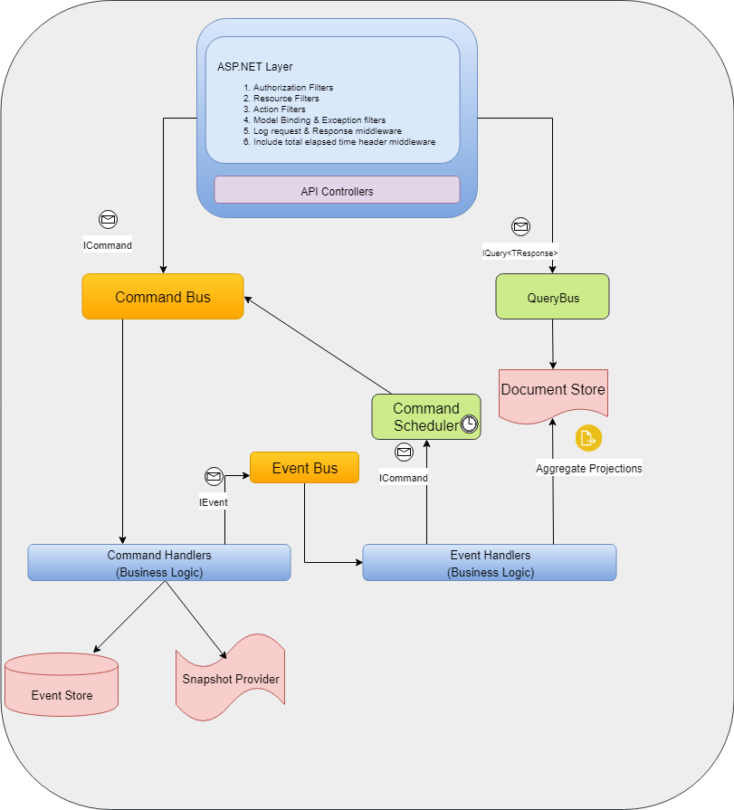

### Business Objective ###

* Provide a Web API to receive, save and process billing orders. 
* The billing orders can be processed in different ways, providing a higher chance of settlement.	 
	 
### Application Architecture ###



### Software Details ###
* FRAMEWORK - .NET Core 2.0
* I.D.E     - VISUAL STUDIO 2017

### How do I get set up? ###

     Download the project source and open OrdersApi.sln file in Visual studio 2017. Its a dockerizable project so you should be all set to start the application.

### Setup Configuration files ###

     1 - appsettings.json: This is the application configuration file whith the option listed below:
	 
	 
| HttpClientSettings | Type | Description                          |
| ------------- | ------------- | -------------|
| UseResilientHttp | bool  | Indicates if the app will use resilient HttpClients |
| HttpClientRetryCount  | int  | Total retries |
| HttpClientExceptionsAllowedBeforeBreaking  | int  | Exceptions allowed before breaking |	 

| MessageBrokerSettings | Type | Description      |
| ------------- | ------------- | ------------- |
| MessageBusType  | int  | 0 - In Memory, 1- RabbitMQ, 2 - Azure Service Bus |
| RetryCount  | int  | Total number of retries  |
| ClearSubscriptionOnStartup  | bool  | Flag to clear event subscriptions on startup  |
| EventBusConnection  | string  | Event bus connection string  |
| EventBusSubscriptionClientName  | string  | Subscription Client name  |
| CommandBusConnection  | string  | Command bus connection | 
| CommandBusPrefetchCount  | string  | Command bus prefetch count| 
| CommandBusMaxConcurrentCalls  | string  | Command bus max concurrent calls |
| EventBusMinimumRetryBackoffSeconds  | int  | Retry minimum back off seconds  |
| EventBusMaximumRetryBackoffSeconds  | int  | Retry maximum back off seconds  |
| EventBusMaxConcurrentCalls  | int  | Maximum number of concurrent calls  |
| EventBusPrefetchCount  | int  | Total number of messages to prefetch  |
| RabbitMqBrokerName  | string  | Broker name for event bus |
| RabbitMqQueueName  | string  | Queue name for event bus |
| RabbitMqUserName  | string  | User name for event bus authentication  |
| RabbitMqPassword  | string  | Password for event bus authentication |
| RabbitMqConnection  | string  | Rabbit MQ Connection (hostname) |
| RabbitMqCommandBusConnection  | string  | Rabbit MQ Connection (hostname) for command bus |
| RabbitMqCommandBusBrokerName  | string  | Broker name  for command bus| 
| RabbitMqCommandBusUserName  | string  | User name for authentication for command bus |
| RabbitMqCommandBusQueueName  | string  | Queue name  for command bus|
| RabbitMqCommandBusPassword  | string  | Password for authentication for command bus | 

| RedisSettings    | Type | Description                        |
| ------------- | ------------- | -------------|
| SnapshotConnectionString | string  | Snapshot provider connection string (Redis Cache) |
| SnapshotFrequency  | int  | Frquency used to save snapshots in the cache |  
| SnapshotMinutesToExpire  | int  | Expiry Timeout | 
     
| HangfireSettings    | Type | Description                        |
| ------------- | ------------- | -------------|
| UseHangfire   | bool  | Hangfir feature flag | 
| UseHangfireCommandScheduler  | string  | Hangfire comkand scheduler feature flag | 
| Prefix  | string  | Prefix for all Redis keys related to Hangfire. | 
| Timeout  | int  | Time interval, within which background job is considered to be still successfully processed by a worker. When a timeout is elapsed, another worker will be able to pick the same background job | 
| ExpiryCheckInterval  | int  | Expiry check interval for hangfire | 
| UseTransactions  | bool  | Flag for the usage of transaction within hangfire | 
| FetchTimeout  | int  | Fetch Timeout | 
| StorageType  | int  | 0 - Redis, 1 - MongoDB | 
| RedisConnectionString  | string  | Hangfire connection string for Redis storage |
| MongoDatabaseName  | string  | Mongo database name | 

| SqlServerEventStoreSettings | Type | Description                           |
| ------------- | ------------- | -------------|
| ConnectionStringSqlite | string  | Connection string for SQLite | 
| ConnectionString | string  | Connection string for SQL Server | 
| UseSqlite | bool  | Use Entity framework with SQLite | 
| UseInMemory | bool  | Use Entity framework in memory |
| ApplyMigrations | bool  | Apply database migrations on startup |
| MaxRetryDelaySeconds | int  | Max retry delay in seconds |
| MaxRetryDelaySeconds | int  | Max retry attempts |
| EventLogRepublishSchedule | cron expression  | Cron expression for the schedule of the failed events pusblisher |

| DocumentStoreSettings   | Type | Description                         |
| ------------- | ------------- | -------------|
| Type | int  | 1- MongoDB, 2- RavenDB, 3- Azure DocumentDB | 

| MongoSettings   | Type | Description                         |
| ------------- | ------------- | -------------|
| ConnectionString | string  | Connection string for MongoDB |
| DatabaseName  | string  | Database name | 
| UseAzureCosmosDb  | bool  | Activates Tls for azure cosmos DB | 

| DocumentDbSettings   | Type | Description                         |
| ------------- | ------------- | -------------|
| Endpoint | string  | Endpoint URI |
| AuthenticationKey  | string  | Authentication Key | 
| DatabaseName  | bool  | Database name | 

| RavenDbSettings   | Type | Description                         |
| ------------- | ------------- | -------------|
| Urls | string[]  | Cluster Urls |
| DatabaseName | string  | Database name |
| UseOptimisticConcurency | bool?  | Flg for optimistic concurrency | 
| MaxNumberOfRequestsPerSession | int?]  | Maximum number of requests per session | 
| NoTracking | bool  | Tracking flag | 
| NoCaching | bool  | Caching flag | 
| TransactionMode | int  | 0- Single node, 1 - Cluster | 

| SwaggerSettings                           |
| --------------------------|
| Details used by swagger to build the app documentation | 

| IntegrationSettings | Type | Description                          |
| ------------- | ------------- | -------------|
| ProcessingRetryInterval | int  |  Timespan in minutes for processing charge retries pooling  |
| ProcessingRetryLimit  | int  | Timespan in minutes to limit processing attempts |
| SettlementVerificationInterval  | int  | Timespan in minutes for settlement verification attempts |
| SettlementVerificationLimit  | int  | Timespan in minutes to limit settlement verification |	   

| AcquirerApiSettings | Type | Description                          |
| ------------- | ------------- | -------------|
| ApplicationUri | string  | Base http uri used to build the requests |
| PosRentKey  | string  | External key for the POS Rent product |
| PosRentChargeTypeCode  | string  | Charge type code POS Rent product in the acquirer API |
| ExternalPosRentKey  | string  | External key for the External/Partners POS Rent product |
| ExternalPosRentChargeTypeCode  | string  | Charge type code External/Partners POS Rent product in the acquirer API |	 
| DefaultChargeTypeCode | string  | Default charge type code | 
| DefaultCurrencyCode | string  | Default currency code  | 
| AuthenticationToken | string  | Authentication token | 
| UseMockApi | bool  | Mock feature flag |
   
### Build Server ###
* We are using VSTS as the build server tool for this application. 
* The workflows can be found at: https://stonepagamentos.visualstudio.com/Cobran%C3%A7a/Cobran%C3%A7a%20Team/_build 
	
### Interfaces and Integrations ###
* Acquirer API
* Cerberus
* Global Identity Manager

### Load Tests ###

We are using JMeter (https://jmeter.apache.org/download_jmeter.cgi) as load testing tool. To run the load tests for the Financial Charging API you need to open JMeter (jmeter.bat inside bin folder) with the following parameters:

* secret -> api secret stored in GIM
* hostname -> api hostname
* port -> api port
* clientkey -> client application key also stored in GIM

Ex.:

```cmd
 jmeter.bat -Jsecret=ZDAzMmRhYmELTgwN2QtOGIyN2QzOTE2OGYz -Jhostname=localhost -Jport=32805 -Jclientkey=782c7053-0972-470c-952a-5498389f445e
```


### Who do I talk to? ###
* Financeiro - Cobrança (financeiroti.cobranca@stone.com.br)
 
